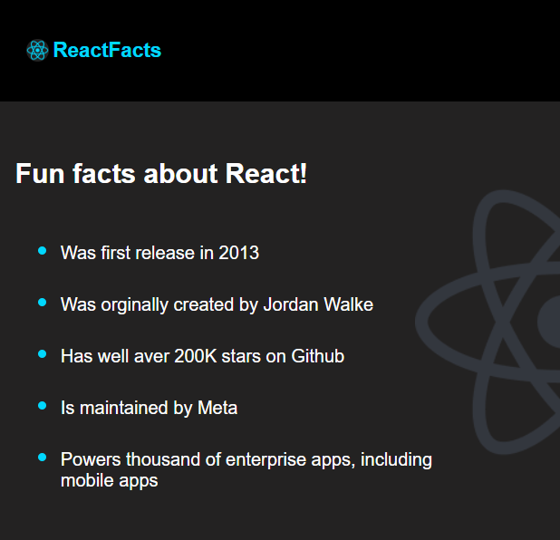

# Day 54 – April 24, 2025

## 📌 Today's Progress:
- Tried following the React course by Chai & Code but found it hard to understand.
- Switched to Bob Ziroll’s React tutorial on freeCodeCamp.
- Spent focused time and understood the concepts deeply.
- Built a static website using React.

## 📖 What I Learned:
- JSX syntax and how it gets rendered in the DOM.
- Functional components and how they return JSX.
- How to structure a basic React project.
- The importance of breaking UI into reusable components.

## 🚀 Project:
Built a static website using React with multiple functional components.

## 💭 Thoughts:
Switching the tutorial really helped! Bob Ziroll’s explanations made React feel much more approachable. I feel more confident moving forward now.
